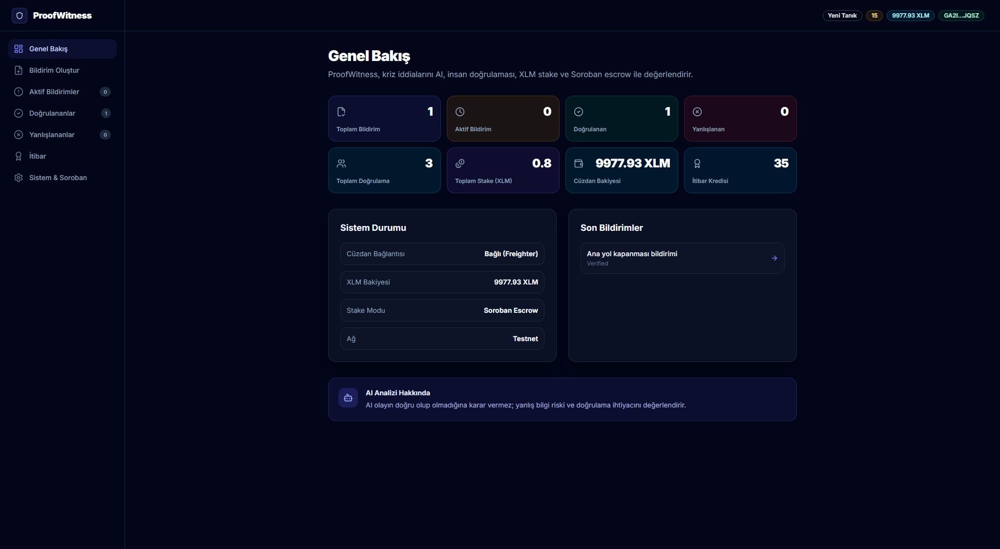
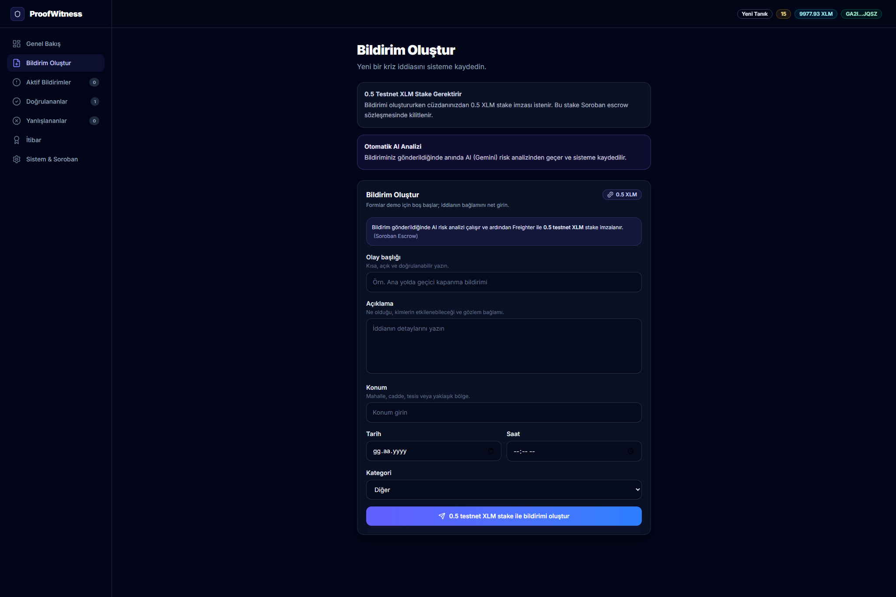
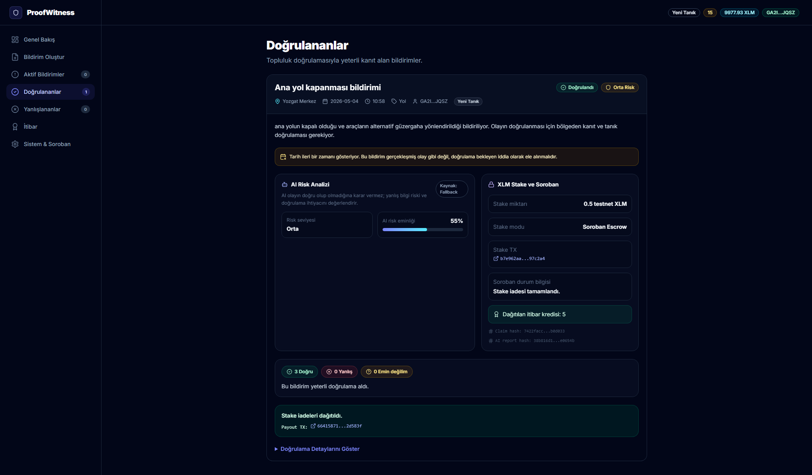
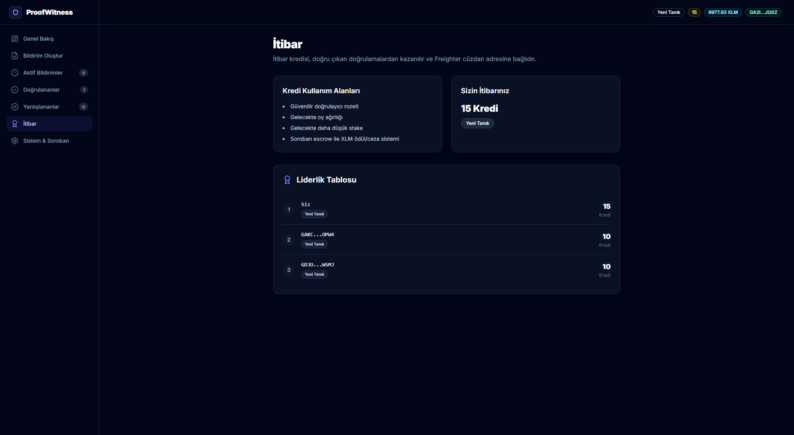

# ProofWitness

ProofWitness is an AI-assisted crisis claim verification platform built on Stellar. It helps reduce misinformation during emergencies by combining AI risk analysis, human evidence, Freighter wallet signatures, XLM staking, and Soroban escrow.

## Problem

During crises, false claims spread fast. Reports about infrastructure failure, earthquake impact, explosions, road closures, emergency access, or public safety can move across communities before anyone has enough context to verify them.

False information can cause panic, misdirect aid, overload emergency channels, and reduce trust in real reports. In a crisis, speed matters, but accountability matters too.

## Solution

ProofWitness lets users:

1. Create a crisis claim.
2. Let AI analyze misinformation risk.
3. Let nearby people verify or dispute the claim with evidence.
4. Stake Testnet XLM through Freighter.
5. Lock stake logic through Soroban escrow.
6. Build wallet-based reputation through accurate contributions.

## Live Demo

Frontend:
https://proofwitness.vercel.app

Backend health:
https://proofwitness.onrender.com/api/health

GitHub:
https://github.com/Kudretthan/proofwitness

Soroban Contract:
CCNWALULXOTPOFUIXXYC7BIDNPSJGHVUDYTPGXZZ6LRPED7ULOYSO56G

Soroban Contract Explorer:
https://stellar.expert/explorer/testnet/contract/CCNWALULXOTPOFUIXXYC7BIDNPSJGHVUDYTPGXZZ6LRPED7ULOYSO56G

Deployment Transaction:
173a9b167f4e6b5a341877609a1c08517b53a382c634df221bf70a33da0734c4

Initialization Transaction:
https://stellar.expert/explorer/testnet/tx/95faf73b257c943ccc8547f69b0c189b86d0aa87c12a7203dcc8989e37437aa8

Native XLM Token Contract:
CDLZFC3SYJYDZT7K67VZ75HPJVIEUVNIXF47ZG2FB2RMQQVU2HHGCYSC

## Screenshots

### Dashboard



### Claim Creation



### Verified Claim



### Reputation



## Deployment Architecture

- **Frontend** is deployed on Vercel.
- **Backend API** is deployed on Render.
- **Shared application data** is stored in Supabase.
- **Blockchain actions** are signed with Freighter and executed on Stellar Testnet / Soroban.
- **AI risk analysis** is handled by the backend using Gemini API.
- **Evidence uploads** are handled by backend local upload storage for MVP/demo purposes.

```text
User Browser
  |
  v
Vercel Frontend
  |
  v
Render Backend -> Gemini API
  |
  v
Supabase Database
  |
  v
Freighter Wallet -> Stellar Testnet / Soroban Escrow
```

## Production URLs

| Service | URL / Identifier |
|---|---|
| Frontend | https://proofwitness.vercel.app |
| Backend Health | https://proofwitness.onrender.com/api/health |
| GitHub Repository | https://github.com/Kudretthan/proofwitness |
| Soroban Contract | CCNWALULXOTPOFUIXXYC7BIDNPSJGHVUDYTPGXZZ6LRPED7ULOYSO56G |
| Soroban Contract Explorer | https://stellar.expert/explorer/testnet/contract/CCNWALULXOTPOFUIXXYC7BIDNPSJGHVUDYTPGXZZ6LRPED7ULOYSO56G |
| Deployment Transaction | 173a9b167f4e6b5a341877609a1c08517b53a382c634df221bf70a33da0734c4 |
| Initialization Transaction | https://stellar.expert/explorer/testnet/tx/95faf73b257c943ccc8547f69b0c189b86d0aa87c12a7203dcc8989e37437aa8 |
| Native XLM Token Contract | CDLZFC3SYJYDZT7K67VZ75HPJVIEUVNIXF47ZG2FB2RMQQVU2HHGCYSC |

## Key Features

- AI risk analysis
- Human verification with evidence
- Freighter wallet connection
- Real Stellar Testnet XLM staking
- Soroban escrow contract
- Claim and verification hashes
- Evidence photo upload
- Reputation credits and badges
- Supabase shared data layer
- Soroban payout and stake refund

## How It Works

1. User connects Freighter.
2. User creates a claim.
3. AI analyzes the claim text, date, time, location, and category.
4. AI does not decide the truth; it only flags risk.
5. User stakes XLM.
6. Claim becomes visible.
7. Other users verify or dispute with notes and optional evidence.
8. Each verification requires XLM stake.
9. Community result changes status:
   - 3 true verifications -> Verified
   - 2 false verifications -> False / Disputed
   - otherwise -> Needs Evidence
10. Reputation credits are assigned to accurate contributors.
11. Soroban escrow handles stake locking and payout logic.

## Important AI Note

AI is not a truth judge. It performs risk analysis. The truth is determined by community evidence and verification results. "AI confidence" is not the probability that the event is true; it is how confident the AI is in its risk analysis. The AI helps triage suspicious or risky claims, but it does not determine truth.

## XLM Staking

- Claim stake: 0.5 Testnet XLM
- Verification stake: 0.1 Testnet XLM
- Freighter signs transactions
- Testnet only, no real funds
- XLM makes spam and false reporting costly

## Soroban Escrow

The Soroban escrow contract was deployed on Stellar Testnet.

Contract ID:

```text
CCNWALULXOTPOFUIXXYC7BIDNPSJGHVUDYTPGXZZ6LRPED7ULOYSO56G
```

Native XLM Token Contract ID:

```text
CDLZFC3SYJYDZT7K67VZ75HPJVIEUVNIXF47ZG2FB2RMQQVU2HHGCYSC
```

Admin:

```text
GBQRMRIH4UCY3YKHCJAHJZII4SFQ66XBBHKKQ7PV6Z6UKJN4F7VOV2C7
```

Contract Explorer:

```text
https://stellar.expert/explorer/testnet/contract/CCNWALULXOTPOFUIXXYC7BIDNPSJGHVUDYTPGXZZ6LRPED7ULOYSO56G
```

Deployment Transaction:

```text
173a9b167f4e6b5a341877609a1c08517b53a382c634df221bf70a33da0734c4
```

Initialization Transaction:

```text
https://stellar.expert/explorer/testnet/tx/95faf73b257c943ccc8547f69b0c189b86d0aa87c12a7203dcc8989e37437aa8
```

In Soroban mode (`VITE_STAKE_MODE=soroban`), XLM stake is locked by smart contract logic. If the Soroban claim transaction succeeds, the stake is locked by the contract. If the Soroban transaction fails, the claim or verification should not be created. Treasury fallback is disabled in Soroban mode to keep the demo flow clear. Treasury fallback is only documented for treasury mode and is not used as the main demo flow.

See [SOROBAN.md](./SOROBAN.md) for contract commands, environment variables, and current limitations.

## Soroban Payout / Stake Refund

- Stake refund becomes available after the claim is resolved.
- 3 true verifications -> claim verified.
- 2 false verifications -> claim disputed.
- The claim creator wallet starts the payout transaction.
- Freighter signs the payout transaction.
- Soroban escrow returns stake to wallets on the winning side.
- Stake from the losing side is not returned.
- If a different wallet tries to start payout, the transaction is rejected as unauthorized.
- The UI only enables the payout button when the connected wallet is the claim creator.
- If payout succeeds, the payout transaction hash is shown.

## Reputation Credits

Reputation credits are tied to the Freighter public key. They reward accurate contributors and help identify wallets that have previously submitted useful crisis verification work.

Badge levels:

- 0-19 credits: New Witness
- 20-49 credits: Trusted Witness
- 50-99 credits: Priority Verifier
- 100+ credits: Community Verifier

In this MVP, reputation is stored locally for demo purposes. A future version can move reputation on-chain or to decentralized storage.

## Tech Stack

Frontend:

- React
- Vite
- TypeScript
- Tailwind CSS
- Freighter API
- Stellar SDK
- Supabase Client (@supabase/supabase-js)

Backend:

- Node.js
- Express
- Gemini API
- Multer upload
- CORS / dotenv

Blockchain:

- Stellar Testnet
- Freighter
- Soroban smart contract
- Native XLM token contract

## Project Structure

```text
proofwitness/
  frontend/
  backend/
  contracts/
    proofwitness_escrow/
  supabase/
    schema.sql
  README.md
  SOROBAN.md
```

## Environment Variables

### Frontend / Vercel

```env
VITE_API_BASE_URL=https://proofwitness.onrender.com
VITE_STAKE_MODE=soroban
VITE_SOROBAN_ESCROW_CONTRACT_ID=CCNWALULXOTPOFUIXXYC7BIDNPSJGHVUDYTPGXZZ6LRPED7ULOYSO56G
VITE_XLM_TOKEN_CONTRACT_ID=CDLZFC3SYJYDZT7K67VZ75HPJVIEUVNIXF47ZG2FB2RMQQVU2HHGCYSC
VITE_STELLAR_NETWORK=testnet
VITE_STELLAR_RPC_URL=https://soroban-testnet.stellar.org
VITE_SUPABASE_URL=your_supabase_project_url
VITE_SUPABASE_ANON_KEY=your_supabase_publishable_or_anon_key
```

> **Important Note:**
> - `VITE_SUPABASE_URL` must be exactly `https://xxxxx.supabase.co`. Do not include `/rest/v1`.
> - `VITE_SUPABASE_ANON_KEY` should be the publishable/anon key, not the secret key.
> - Do not commit `.env` files.

### Backend / Render

```env
GEMINI_API_KEY=your_gemini_api_key
FRONTEND_URL=https://proofwitness.vercel.app
```

## Supabase Shared Data Layer

- The first MVP used `localStorage`.
- The current version adds Supabase.
- Different users can see the same claim and verification records.
- **Tables:**
  - `claims`
  - `verifications`
  - `credit_ledger`
- RLS is disabled / open access is used for the hackathon MVP.
- Production requires proper RLS policies.

## Deployment Steps

### Backend on Render

1. Create a Web Service from GitHub repository.
2. Root Directory: `backend`
3. Build Command: `npm install`
4. Start Command: `npm start`
5. Add environment variables:
   - `GEMINI_API_KEY`
   - `FRONTEND_URL`
6. Deploy and test:
   https://proofwitness.onrender.com/api/health

### Frontend on Vercel

1. Import GitHub repository.
2. Root Directory: `frontend`
3. Framework Preset: `Vite`
4. Build Command: `npm run build`
5. Output Directory: `dist`
6. Add `VITE_` environment variables.
7. Add the Vercel SPA routing rewrite:
   - React/Vite routes like `/system` need Vercel rewrite support.
   - `frontend/vercel.json` should route all paths to `index.html`.
   - This prevents 404 errors on direct route refresh.
8. Deploy.

### Supabase

1. Create Supabase project.
2. Create tables:
   - `claims`
   - `verifications`
   - `credit_ledger`
3. Add Project URL and publishable/anon key to Vercel.
4. Redeploy frontend.

## Deployment Troubleshooting

Common errors:

- **Supabase 404 / Invalid path**:
  `VITE_SUPABASE_URL` should not include `/rest/v1`.
- **Supabase No API key**:
  `VITE_SUPABASE_ANON_KEY` is missing or has the wrong environment variable name.
- **Vercel env changes**:
  Redeploy required after environment variable changes.
- **Freighter txBadAuth**:
  Payout must be started by the claim creator wallet.
- **Render cold start**:
  Backend may take 30-60 seconds on the free tier.
- **Treasury demo showing in Soroban mode**:
  Check `VITE_STAKE_MODE=soroban` and redeploy.

## Test Commands

Backend health:

```bash
curl http://localhost:4000/api/health
```

Analyze claim with PowerShell:

```powershell
$body = @{
  title = "Test"
  description = "Test description"
  location = "Test location"
  incidentDate = "2026-05-02"
  incidentTime = "14:30"
  category = "other"
} | ConvertTo-Json

Invoke-RestMethod -Uri "http://localhost:4000/api/analyze-claim" -Method POST -ContentType "application/json" -Body $body
```

Frontend build:

```bash
cd frontend
npm run build
```

Soroban build:

```bash
cd contracts/proofwitness_escrow
stellar contract build
```

## Demo Flow

1. Open live site.
2. Connect Freighter on Testnet.
3. Create a claim.
4. Approve Soroban/XLM stake transaction.
5. Show AI risk analysis.
6. Add three true verifications from wallets.
7. Claim moves to Verified.
8. Connect claim creator wallet.
9. Click "Distribute Stake Refunds".
10. Approve Freighter payout transaction.
11. Show payout transaction hash.
12. Show reputation and system pages.

**Important Demo Details:**

- Render free instance may sleep and take 30-60 seconds for the first backend request.
- Freighter must be set to Testnet.
- Use different Freighter accounts to demonstrate community verification.
- If live demo fails, the project can still be demonstrated locally while the Soroban contract remains live on Stellar Testnet.

## Current MVP Limitations

- Hackathon MVP.
- Stellar Testnet only.
- Testnet XLM has no real value.
- Supabase is used for shared state; production needs RLS.
- Evidence upload storage needs permanent storage like IPFS/Filebase/Cloudinary.
- Contract needs audit before production.
- Official data/oracle integrations are future work.

## Future Work

- IPFS/Filebase evidence storage
- AFAD/Kandilli or official data integrations
- Map-based nearby verification
- On-chain reputation
- Weighted voting
- Full Soroban escrow reward distribution
- Mobile-first field reporter mode
- AI image verification
- Notification system

## One-liner Pitch

ProofWitness turns crisis reporting into an accountable, evidence-based process by combining AI triage, human verification, Freighter-signed XLM staking, and Soroban escrow.
